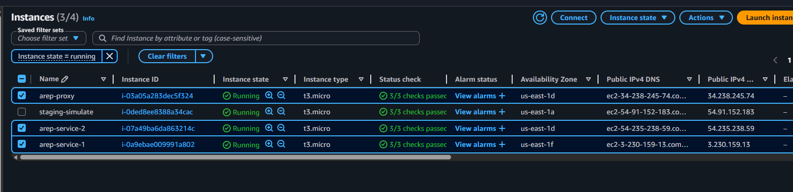
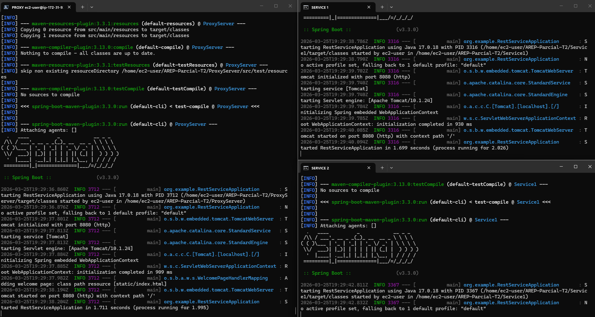

# AREP Parcial T2 — Search Microservices


https://github.com/user-attachments/assets/b1903751-7064-4282-acb9-c8c143235338

> Sistema de microservicios con proxy y dos servicios backend en Spring Boot para búsqueda lineal y binaria, desplegados en instancias EC2 de AWS.

---

## Arquitectura


| Componente | Descripción | Puerto |
|---|---|---|
| **ProxyServer** | Gateway REST que recibe las peticiones del cliente y las delega al servicio backend con failover. | `8080` (default) |
| **Service1** | Expone **ambos algoritmos**: búsqueda lineal (`/linearsearch`) y binaria (`/binarysearch`). | `8080` |

**Flujo:** `Browser → ProxyServer (EC2) → Service1 (EC2)`

El proxy intenta primero contra la instancia EC2 #1; si falla, reintenta contra EC2 #2 (failover).

> [!IMPORTANT]
> Originalmente los algoritmos estaban separados en dos servicios (`Service1` y `Service2`). Para simplificar el despliegue y el mantenimiento, ambos endpoints (`/linearsearch` y `/binarysearch`) fueron concretados en **Service1**. `Service2` ya no se despliega.

---

## Estructura del proyecto

```text
AREP-Parcial-T2/
├── ProxyServer/   # Servidor Gateway con failover
├── Service1/      # Microservicio con algoritmos de búsqueda
└── img/           # Diagramas y evidencias de despliegue
```

---

## Algoritmos implementados

### Búsqueda Lineal (Service1)

Recorre el arreglo secuencialmente comparando cada elemento con el valor buscado. Retorna el índice del primer encuentro o `-1` si no se encuentra. Complejidad: $O(n)$.

```java
public static int logic(int[] items, int value) {
    for (int i = 0; i < items.length; i++) {
        if (items[i] == value) {
            return i;
        }
    }
    return -1;
}
```

### Búsqueda Binaria Recursiva (Service2)

Divide el arreglo ordenado a la mitad en cada paso de manera recursiva, descartando la mitad donde el valor no puede estar. Garantiza retornar el primer encuentro del item. Complejidad: $O(log n)$

```java
public static int logic(int[] items, int value) {
    return binarySearchRecursive(items, value, 0, items.length - 1);
}

private static int binarySearchRecursive(int[] items, int value, int low, int high) {
    if (low > high) return -1;
    int mid = low + (high - low) / 2;
    if (items[mid] == value) {
        if (mid > low && items[mid - 1] == value)
            return binarySearchRecursive(items, value, low, mid - 1);
        return mid;
    } else if (items[mid] > value) {
        return binarySearchRecursive(items, value, low, mid - 1);
    } else {
        return binarySearchRecursive(items, value, mid + 1, high);
    }
}
```

---

## Requisitos

- Java 17+
- Maven 3.x
- Git

---

## Instalación y ejecución

1. Clonar:

```bash
git clone https://github.com/OneCode182/AREP-Parcial-T2.git
cd AREP-Parcial-T2
```

2. Compilar los módulos necesarios:

```bash
cd Service1 && mvn clean package && cd ..
cd ProxyServer && mvn clean package && cd ..
```

3. Ejecutar (cada uno en una terminal separada):

```bash
# Service1 — ambos algoritmos, puerto 8080
cd Service1 && java -jar target/*.jar

# ProxyServer — gateway, puerto por defecto
cd ProxyServer && java -jar target/*.jar
```

---

## Uso del API

### Linear Search

```
GET /linearsearch?list=10,20,13,40,60&value=13
```

Respuesta:

```json
{
  "operation": "linearSearch",
  "inputlist": [10, 20, 13, 40, 60],
  "value": 13,
  "output": 2
}
```

Cuando el valor no existe:

```
GET /linearsearch?list=10,20,13,40,60&value=99
```

```json
{
  "operation": "linearSearch",
  "inputlist": [10, 20, 13, 40, 60],
  "value": 99,
  "output": -1
}
```

### Binary Search

```
GET /binarysearch?list=10,20,13,40,60&value=13
```

```json
{
  "operation": "binarySearch",
  "inputlist": [10, 20, 13, 40, 60],
  "value": 13,
  "output": 2
}
```

---

## Evidencia de despliegue

### Services y EC2 desplegadas





---

## Author

**Sergio Andrey Silva Rodriguez**
*Systems Engineering Student*
Escuela Colombiana de Ingeniería Julio Garavito

## License

This project is for educational purposes as part of the AREP course at Escuela Colombiana de Ingeniería Julio Garavito.
