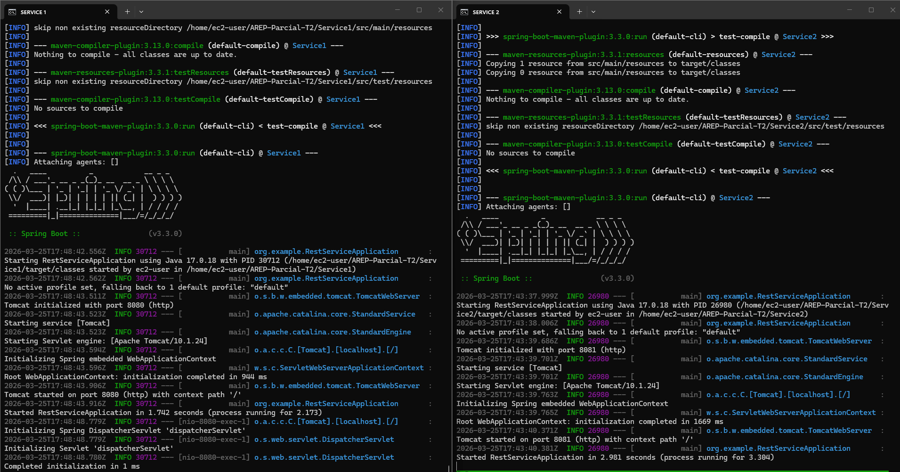

# AREP Parcial T2

> [!INFO]
> Student: Sergio Andrey Silva Rodriguez
> AREP 3 - 301 Group

Este proyecto implementa un prototipo de sistema de microservicios para computar funciones numéricas.
La arquitectura incluye:

- Servicio REST (Math Services) en Spring Boot desplegado en dos instancias EC2.
- Service Proxy en otra instancia EC2 que distribuye las solicitudes con algoritmo round-robin.
- Configuración de direcciones y puertos mediante variables de entorno.
- Despliegue en AWS usando Maven, Git y GitHub.

### Services and EC2 Deployed

